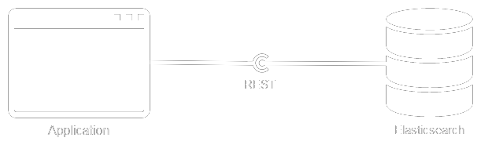
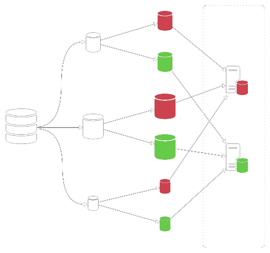
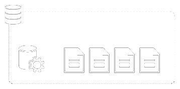

---


### À la recherche du temps perdu

---

## Présentation

Pourquoi ?
- Recherche avancée
- Analyse des résultats

Comment ?
- RESTful API
- Système distribué (shards)
- Orienté document

+++

## RESTful API



- PUT /index
- GET /index
- POST /index/_search
- DELETE /index

+++

## Système distribué



+++

## Orienté document



---

## Fonctionnement global

1. Création de l’index

2. Indexation de documents

3. Recherche

+++

## Création de l’index

On vérifie que le serveur est lancé
```bash
GET / # curl -XGET 127.0.0.1:9200
```

On crée l’index
```bash
PUT /demo # curl -XPUT 127.0.0.1:9200/demo
```

On vérifie que l’index est créé
```bash
GET /demo # curl -XGET 127.0.0.1:9200/demo
```

+++ 

## Indexation de documents

Par défaut, le mapping est créé dynamiquement

```json
POST /demo/book
{
  "title": "20.000 lieues sous les mers",
  "author_first_name": "Jules",
  "author_last_name": "Verne",
  "year": 1870,
  "category": ["Roman"],
  "summary": "L'apparition d'une bête monstrueuse […]"
}
```

+++

## Recherche

Toute recherche se fait sur un endpoint `_search`

```json
POST /demo/_search
{
  "query": {
    "query_string": {
      "query": "monstrueuse"
    }
  }
}
```

+++

## Exemple de résultat de recherche

```json
{ "took": 68,
  "timed_out": false,
  "_shards": {
    "total": 5,
    "successful": 5,
    "failed": 0
  },
  "hits": {
    "total": 1,
    "max_score": 0.27233246,
    "hits": [{
      "_index": "demo",
      "_type": "book",
      "_id": "AVsaKvqVDq8H12fKI101",
      "_score": 0.27233246,
      "_source": {
        "title": "20.000 lieues sous les mers", […]
      }
}}]}}
```

---

## Accès à un document

```json
GET /demo/book/AVsaKvqVDq8H12fKI101
```

```json
PUT /demo/book/AVsaKvqVDq8H12fKI101
{
  "title": "20.000 lieues sous les mers",
  "author_first_name": "Jules",
  "author_last_name": "Verne",
  "year": 1870,
  "category": ["Roman", "Aventure"],
  "summary": "L'apparition d'une bête monstrueuse […]" }
```

```json
DELETE /demo/book/AVsaKvqVDq8H12fKI101
```

---

## Les différents types de recherche

- Full-text (`match`, `match_phrase`, `multi_match`, `query_string`…) pour les titres, les emails, les corps de texte
- Exacte (`exists`, `term`, `range`, `regexp`, `wildcard`…) pour les nombres, les dates ou les mots-clés
- Composée (`bool`…) pour des recherches avancées, en mixant les types précédents
- Autres (`nested`, `geo_distance`, `geo_polygon`…)

---

## Match Query

La plus simple, on laisse Elasticsearch analyser la chaîne de caractères
passée, et créer une Bool Query adaptée (opérateur ou par défaut).

```json
POST /demo/_search
{
  "query": {
    "match": {
      "title": "mers"
}}}
```

+++

## Match Query

On peut aussi faire la requête tous les champs, ou encore changer
l’opérateur booléen utilisé.

```json
POST /demo/_search
{
  "query": {
    "match": {
      "_all": {
        "query": "Verne aventure",
        "operator": "and"
}}}}
```

---

## Match Phrase Query

On recherche une suite de mots dans l’ordre.

```json
POST /demo/_search
{
  "query": {
    "match_phrase": {
      "title": "sous les mers"
}}}
```

+++

## Match Phrase Query

Le paramètre `slop` permet d’autoriser un certain nombre de décalages.
Deux mots inversés comptent pour un décalage de 2.

```json
POST /demo/_search
{
  "query": {
    "match_phrase": {
      "title": "sous les mers",
      "slop": 3
}}}}
```

---

## Multi Match Query

Très utile et puissante,  
il s’agit d’une Match Query sur plusieurs champs,  
dans le cas où on ne veut pas utiliser `_all`.

```json
POST /demo/_search
{
  "query": {
    "multi_match": {
      "query": "aventure",
      "fields": ["title", "category"]
}}}
```

+++

## Multi Match Query

On peut utiliser des wildcards dans le nom des champs, ou encore booster
les scores de certains champs.

```json
POST /demo/_search
{
  "query": {
    "multi_match": {
      "query": "jules",
      "fields": ["author_*_name^3", "summary"]
}}}
```

+++

## Multi Match Query

La Multi Match Query peut aussi utiliser des Match Phrase Queries à la
place des Match Queries.

```json
POST /demo/_search
{
  "query": {
    "multi_match": {
      "query": "une force colossale",
      "type": "phrase",
      "fields": ["title", "summary"]
}}}
```

+++

## Multi Match Query

Il existe 5 types de Multi Match Query :
- `best_fields` (par défaut) ⇒ meilleur score
- `most_fields` ⇒ moyenne des scores
- `phrase` (`match_phrase` + `best_fields`)
- `phrase_prefix` (`match_phrase_prefix` + `best_fields`)
- `cross_fields` ⇒ tous les termes recherchés doivent se trouver dans au moins un des champs

---

## Query String Query

Elle permet d’exécuter une requête littérale.

```json
POST /demo/_search
{
  "query": {
    "query_string": {
    "query": "title:(mer~ OR ciel~) +category:aventure
              +year:<=1900 -author_last_name:Verne"
}}}
```

Elle utilise un mini langage complet permettant d’utiliser les différents
opérateurs, les boosts, les wildcards, les regex, le fuzziness, les ranges...

---

## Term Query

Permet de rechercher un terme exact. Attention, un champ peut être
analysé de plusieurs manières selon votre mapping ; une Term Query
fonctionnera bien sur un type `keyword`, moins sur un type `text`.

```json
POST /demo/_search
{
  "query": {
    "term": {
      "title": "20.000 lieues sous les mers"
}}}
```

---

## Range Query

Permet de rechercher sur des intervalles.

```json
POST /demo/_search
{
  "query": {
    "range": {
      "year": {
        "gte": 1800,
        "lt": 1900
}}}}
```

+++

## Range Query

Les intervalles de dates supportent une syntaxe avancée.

```json
POST /demo/_search
{
  "query": {
    "range": {
      "date": {
        "gte": "2017-01-01||",
        "lt": "now+1M/d"
}}}}
```

---

## Bool Query

```json
POST /demo/_search
{ "query": {
    "bool": {
      "must": [
        { "range": { "year": { "lt": 1900 } } }
      ],
      "should": [
        { "term": { "category": "fiction" } },
        { "term": { "category": "aventure" } }
      ],
      "minimum_should_match": 1
}}}
```

--- 

## Le mapping

- Données différentes
- Utilisations différentes
- Stockages différents

Le mapping définit la manière de  
stocker et d'indexer les données.

---

## Type

Définit uniquement le type de données stockées, et aucunement la façon
dont elles seront analysées.

```json
PUT /demo
{ "mappings": {
    "book": {
      "properties": {
        "title": {
          "type": "text"
}}}}}
```

---

## Index

Permet d’exclure un champ de l’indexation

```json
PUT /demo
{ "mappings": {
    "book": {
      "properties": {
        "sales": {
          "type": "integer",
          "index": false
}}}}}
```

---

## Include_in_all

Permet d’include/exclure un champ de la recherche globale sur `_all`.
La valeur par défaut est true, sauf si index est défini à false.

```json
PUT /demo
{ "mappings": {
    "book": {
      "properties": {
        "meta_title": {
          "type": "text",
          "include_in_all": false
}}}}}
```

---

## Format

Réservé au type date, le format permet de stocker une date autrement que
sous un format timestamp.

```json
PUT /demo
{ "mappings": {
    "book": {
      "properties": {
        "year": {
          "type": "date",
          "format": "yyyy"
}}}}}
```

---

## Analyzer

Permet de choisir l’analyzer à utiliser pour ce champ.  
On peut utiliser les analyzers existant, ou en créer d’autres.

```json
PUT /demo
{ "mappings": {
    "book": {
      "properties": {
        "summary": {
          "type": "text",
          "analyzer": "french"
}}}}}
```

---

## Fields

Permet de créer des champs multiples. Très utile pour l’i18n et pour avoir
plusieurs indexations différentes pour le même contenu.

```json
PUT /demo
{ "mappings": {
    "book": {
      "properties": {
        "title": {
          "type": "text",
          "fields": {
            "fr": { "type": "text", "analyzer": "french" },
            "en": { "type": "text", "analyzer": "english" }
}}}}}}
```

+++

## Fields

On peut accéder au champ "par défaut" :

```json
POST /demo/_search
{ "query": {
    "match": {
      "title": "la mer"
}}}
```

Mais aussi aux "sous-champs" :

```json
POST /demo/_search
{ "query": {
    "match": {
      "title.en": "la mer"
}}}
```

+++

## Fields

Enfin, il est possible de recherche sur tous les champs/langages à la fois :

```json
POST /demo/_search
{ "query": {
    "multi_match": {
      "query": "la mer",
      "fields": [
        "title.*" ]}}}
```

```json
POST /demo/_search
{ "query": {
    "multi_match": {
      "query": "la mer",
      "fields": [
        "*.fr" ]}}}
```

---

## Les analyzers

L’analyzer permet de prendre en compte :
- La ponctuation
- Les pluriels
- Les élisions (l’, d’, qu’, jusqu’…)
- Les stopwords (de, au, le, vers, à…)

Il existe déjà de nombreux analyzer, mais il est possible
de définir les siens (utilisation avancée).

+++

## Fonctionnement

À l’indexation :
- Nettoyage
- Division en tokens
- Stockage

À la recherche
- Mêmes étapes
- Comparaison des tokens

+++

## Fonctionnement


+++

## Analyzers natifs

- Standard (par défaut)
- Language (`french`, `english`…)
- Keyword
- Simple
- Stop
- Whitespace
- Pattern
- Fingerprint

+++

## Conséquences sur l’indexation

```bash
GET /demo/_analyze?analyzer=french&text=Joyeuses misères de trois voyageurs en Scandinavie
> joyeu, miser, troi, voyageu, scandinav
```

```bash
GET /demo/_analyze?analyzer=english&text=Joyeuses misères de trois voyageurs en Scandinavie
> joyeus, misèr, de, troi, voyageur, en, scandinavi
```

```bash
GET /demo/_analyze?analyzer=standard&text=Joyeuses misères de trois voyageurs en Scandinavie
> joyeuses, misères, de, trois, voyageurs, en, scandinavie
```

+++

## Conséquences sur la recherche

*Joyeuses misères de trois voyageurs en Scandinavie*

| | standart | english | french |
|:---:|:---:|:---:|:---:|
| joyeuses | <span class="ok">✓</span> | <span class="ok">✓</span> | <span class="ok">✓</span> |
| joyeuse | <span class="notok">✗</span> | <span class="ok">✓</span> | <span class="ok">✓</span> |
| joyeux | <span class="notok">✗</span> | <span class="notok">✗</span> | <span class="ok">✓</span> |
| scandinavie | <span class="ok">✓</span> | <span class="ok">✓</span> | <span class="ok">✓</span> |
| scandinave | <span class="notok">✗</span> | <span class="notok">✗</span> | <span class="ok">✓</span> |
| voyage | <span class="notok">✗</span> | <span class="notok">✗</span> | <span class="notok">✗</span> |

---

## Un analyzer French custom

```json
PUT /demo
{ "settings": {
    "analysis": {
      "analyzer": {
        "french_analyzer": {
          "tokenizer": "standard",
          "filter": [
            "french_elision", // l, m, t, qu…
            "lowercase",      // ne pas tenir compte de la casse
            "asciifolding",   // ne pas tenir compte des accents
            "french_stop",    // aucun
            "french_stemmer"  // analyser comme étant du français
]}}}}}
```

+++

## Un analyzer French custom

Pour prendre en compte les fautes sur les accents.

```bash
GET /demo/_analyze?analyzer=french&text=août
> août
```

```bash
GET /demo/_analyze?analyzer=french_custom&text=août
> aout
```

+++

## Un analyzer French custom

Pour prendre en compte les stopwords.

```bash
GET /demo/_analyze?analyzer=french&text=jusqu'au bout
> bout
```

```bash
GET /demo/_analyze?analyzer=french_custom&text=jusqu'au bout
> au bout
```

---

## Pagination

On peut utiliser les paramètres from et size pour de la pagination.

```json
POST /demo/_search
{
  "from": 0,
  "size": 10,
  "query": {
    "match_all": {}
  }
}
```

---

## Agrégations

Elles permettent d’obtenir des données agrégées basées sur une requête.
On l’utilisera principalement pour améliorer les filtres.

```json
POST /demo/book/_search
{
  "aggregations": {
    "category": {
      "terms": {
        "field": "category",
        "size": 10
  }}},
  "query": {
    "match_all": {}
}}
```

+++

## Agrégations

Metrics Aggregations :  
Avg, Sum, Max, Min, Geo Bounds, Geo Centroid...

Bucket Aggregations :  
Terms, Range, Date Range, Geo Distance, Filter...

---

## Elasticsearch-PHP

Implémentation officielle en PHP

```php
$client = Elasticsearch\ClientBuilder::create()
  ->setHosts(['localhost:9200'])
  ->build();
$response = $client->search([
  'index' => 'demo',
  'body' => [
    'query' => [
      'match' => [ 'title' => 'mers' ]
    ]
  ]
]);
```

+++

## Fonctions principales

```php
// Indexes
$client->indices()->exists($params);
$client->indices()->create($params);
$client->indices()->open($params);
$client->indices()->close($params);

// Documents
$client->index($params);
$client->delete($params);
$client->search($params);
```

---

## Intégration dans Drupal

- Elasticsearch connector (contrib)  
⇒ Pour gérer la connexion à l’index
- Elasticsearch Manager (custom)  
⇒ Pour gérer l’indexation
- Quels types indexer ?
- Quels champs indexer ?
- Comment indexer ces champs ?
- Indexation manuelle et automatique

+++

## Intégration dans Drupal

Requêtes imbriquées avec Bool Query
- Filtre catégorie : Term Query
- Filtre date : Range Query
- Phrase : Multi Match Phrase Query
- Mots : Query String Query

Agrégateurs de type Term pour les filtres

---

## Ressources utiles

Documentation : <a href="https://www.elastic.co/guide/en/elasticsearch/reference/current/index.html" target="_blank">elastic.co/guide</a>

Elasticsearch-PHP : <a href="https://github.com/elastic/elasticsearch-php" target="_blank">github://elastic/elasticsearch-php</a>

Sense : <a href="https://chrome.google.com/webstore/detail/sense-beta/lhjgkmllcaadmopgmanpapmpjgmfcfig" target="_blank">chrome://sense</a> (console)

Dejavu : <a href="https://chrome.google.com/webstore/detail/dejavu/lcanobbdndljimodckphgdmllahfcadd" target="_blank">chrome://dejavu</a> (web UI)

---

cimer.

<a href="https://twitter.com/zessx" target="_blank">@zessx</a>