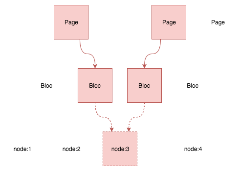
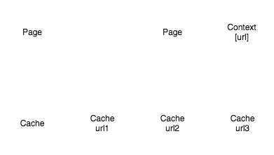

---


### Cache Investigation

---

## Les différents caches

- Cache applicatif
- Cache d'objets
- Cache de rendu
- Cache de TWIG
- Cache HTTP

+++

### Le cache applicatif

Il permet de mettre en cache des variables PHP :
- pour une requête HTTP (cache d'exécution)
- pour une durée plus longue (cache statique)

Son utilisation doit être limitée à de l'optimisation de performances sur des portions de code lourdes, pour éviter de saturer la mémoire.

+++

### Le cache d'objets

Transparent, il se charge de mettre en cache toutes les entités et les configurations. On est toujours dans la couche applicative, mais directement au niveau du framework.

+++

### Le cache de rendu

Premier cache qui influe sur l'expérience utilisateur, c'est le plus important et le plus complexe à paramétrer. Son rôle est de définir le contexte, la durée de vie et les condition de regénération des templates. 

+++

### Le cache de TWIG

Ce n'est proprement dit pas un cache lié à Drupal, mais il est bon de savoir que TWIG met les templates compilés en cache. Tant que le fichier source ne change pas, ce cache n'aura aucun impact sur l'utilisateur final.

+++

### Le cache HTTP

Equivalent du cache de rendu, à un niveau plus élevé (par page). Drupal gère ce cache tout seul, en se basant sur toutes les méta-données du cache de rendu.

---

## La configuration par défault

Drupal fournit une gestion de cache pré-configurée. Celle-ci se compose de deux modules (`Internal Page Cache` et `Dynamic Page Cache`), et d'un système de cache défini dans les fichiers de configuration.

+++

### Internal Page Cache

Ce module met des pages entières en cache pour les utilisateurs anonymes. Il est parfait pour des sites majoritairement statiques, sans gestion d'utilisateurs.

La seule option de configuration de ce module est la durée de mise en cache.

+++

### Dynamic Page Cache

Ce module met des portions de pages (templates) en cache. Il demande plus de travail en amont, mais permet d'avoir une gestion de cache performante.

Aucune configuration n'est requise, car le module se base directement sur les méta-données définies dans les Controllers.

+++

### Le système de cache

Par défaut, le cache est stocké en base de données (dans les tables `tb_cache_`), mais il est possible de changer le système dans le fichier `settings.php` (exemple ci-dessous avec Memcache) :

```php
$settings['cache']['default'] = 'cache.backend.memcache';
```

La clé `cache.backend.memcache` fait référence à un service Drupal, qui devra être défini en amont, probablement dans un module.

---

## Désactiver le cache : la Factory

Tout système de cache doit respecter l'interface `Drupal\Core\Cache\CacheFactoryInterface`.

Comme on ne peut pas simplement supprimer le système de cache, on va utiliser la classe `Drupal\Core\Cache\NullBackendFactory`, qui propose un système de gestion de cache "vide", sans aucun traitement. 

+++ 

### Désactiver le cache : le service

Le fichier `sites/develoment.services.yml` (pré-existant) définit un service pour utiliser cette Factory :

```yml
services:
  cache.backend.null:
    class: Drupal\Core\Cache\NullBackendFactory
```

Le nom du service sera `cache.backend.null`.

+++

### Désactiver le cache : utilisation du service

On va charger le fichier YAML, dans le fichier `sites/default/settings.local.php`, pour pouvoir utiliser le service :

```php
$settings['container_yamls'][] = DRUPAL_ROOT . '/sites/development.services.yml';

$settings['cache']['bins']['render'] = 'cache.backend.null';
$settings['cache']['bins']['dynamic_page_cache'] = 'cache.backend.null';
```

Le fichier `sites/default/settings.local.php` sera ensuite chargé depuis `sites/default/settings.php`.

+++

### Désactiver le cache : TWIG

En addition à tout cela, il faut penser à désactiver le cache de TWIG, dans `sites/development.services.yml` :

```yml
parameters:
  twig.config:
    debug: true
    auto_reload: true
    cache: false
```

+++

### Désactiver le cache : les préprocesseurs

Enfin, il ne reste plus qu'à désactiver les préprocesseurs JS et CSS, dans `sites/default/settings.local.php` :

```php
$config['system.performance']['css']['preprocess'] = FALSE;
$config['system.performance']['js']['preprocess'] = FALSE;
```

Le fichier par défaut (`sites/example.settings.local.php`) contient quelques autres lignes intéressantes pour un environnement de développement.

---

## Les méta-données de cache

Il existe 3 types de méta-données de cache :
- les tags
- les contextes
- les dépendances temporelles

---

## Les tags

Ils permettent de définir une dépendence de votre template, à une entité ou une clé de configuration. Si l'entité change, tous les éléments de cache qui l'utilisent seront invalidés.

+++

### Le fonctionnement des tags



+++

### Un exemple d'utilisation des tags

```php
public function myRenderFunction()
{
  return array(
    '#theme' => 'my_template',
    '#cache' => [
      'tags' => ['node:3']
    ]
  );
}
```

+++

### Les différents tags disponibles

- Les tags d'entité (`node:3`, `term:56`)
- Les tags de configuration (`config:system.performance`)
- Les tags personnalisés (`node_list`...)

+++

### Invalider un tag personnalisé

```php
use Drupal\Core\Cache\Cache;

Cache::invalidateTags(array('my_custom_tag'));
```

---

## Les contextes 

Ils permettent de définir une dépendence de votre template, à un contexte particulier. Un même template aura donc un élément de cache par contexte.

+++

### Le fonctionnement des contextes



+++

### Un exemple d'utilisation des contextes

```php
public function myRenderFunction()
{
  return array(
    '#theme' => 'my_template',
    '#cache' => [
      'contexts' => ['url', 'user.permissions']
    ]
  );
}
```

+++

### Les différents contextes disponibles

- Les cookies (`cookies:cookiesplease_status`)
- Les headers (`header:headers:User-Agent`)
- La langue (`language:fr`)
- L'url (`url.query_args`, '`url.path.is_front`)
- L'utilisateur (`user.is_super_user`, `user.roles`, `user.permissions`)
- La route (`route.name`, `route.menu_active_trails`)
- ... (`session.exists`, `theme`, `timezone`, `ip`)

---

## Les dépendances temporelles 

Comme dans tout système de cache, il est possible de définir une durée maximale de rétention pour tout élément de cache.

+++

### La clé `max-age`

```php
use Drupal\Core\Cache\Cache;

public function myRenderFunction()
{
  return array(
    '#theme' => 'my_template',
    '#cache' => [
      'max-age'  => Cache::PERMANENT,
      'tags'     => ['node_list'],
      'contexts' => ['url.query_args:q', 'user:roles']
    ]
  );
}
```

---

## Fusion de configurations

Il est possible de fusionner des configuration (tags, contextes et dépendances temporelles) à l'aide des fonctions suivantes :

```php
$render['#cache']['contexts'] = Cache::mergeContexts(
    $render['#cache']['contexts'], 
    $node->getCacheContexts()
);
/* Aussi disponibles :
 * Cache::mergeTags()
 * Cache::mergeMaxAges()
 */
```

---

## Les JsonResponse

L'objet `JsonResponse` permet de renvoyer du JSON. Voici un exemple d'utilsation basique :

```php
public function getJson(Request $request) 
{
  $data = [...];
  return new JsonResponse($data);
}
```

Les données renvoyées ne sont pas mises en cache.

+++

### Les CacheableJsonResponse

L'objet `CacheableJsonResponse` permet d'ajouter une clé `#cache` dans votre réponse, afin de gérer le cache sur vos APIs de ma même manière que sur vos templates :

```php
public function getJson(Request $request) 
{
  $data = [
    ...
    '#cache' => ['max-age' => 3600]
  ];
  $response = new CacheableJsonResponse($data);
  $response->addCacheableDependency(CacheableMetadata::createFromRenderArray($data));
  return $response;
}
```

---

## Mettre des objets en cache

Il est possible de mettre ce que l'on veut en cache. C'est particulièrement utile pour les résultats d'opérations nécessitant un temps de traitement important.

```php
$cid = 'my_module:my_cache_key';

$data = NULL;
if ($cache = \Drupal::cache()->get($cid)) {
  $data = $cache->data;
} else {
  $data = my_module_long_calculation();
  \Drupal::cache()->set($cid, $data);
}
```

+++

### Taguer ses objets

Tout comme avec la gestion du cache de rendu TWIG, il est possible de définir une durée maximale de stockage, ainsi que des tags :

```php
$tags = array('my_custom_tag', 'node:13');
\Drupal::cache()->set($cid, $data, Cache::CACHE_PERMANENT, $tags);
```

---

## Ressources utiles

Documentation de l'API Cache : <a href="https://www.drupal.org/docs/8/api/cache-api" target="_blank">drupal.org</a>

Pour toute question : <a href="https://drupal.stackexchange.com/" target="_blank">drupal.stackexchange.com</a>

---

cimer.

<a href="https://twitter.com/zessx" target="_blank">@zessx</a>