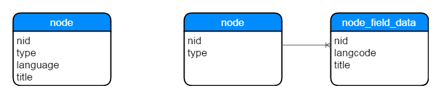
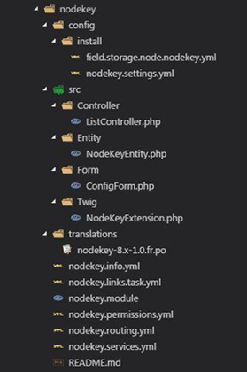
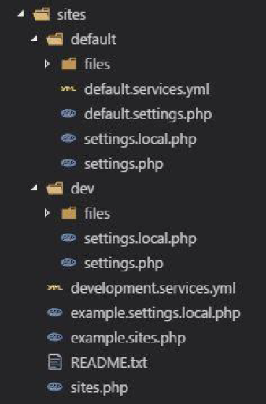

---


### Harder, Better, Stronger

---

## Du module au natif

Plusieurs fonctionnalités désormais intégrées dans le coeur :
- i18n
- Types de champs
- Views
- Services web
- Entity Reference

---

## Des fonctionnalités améliorées

Plus besoin de dupliquer les blocs, ils sont à présent instantiables.

Le système de cache a entièrement été revu et est beaucou plus (trop ?) performant.

La gestion du multisites a été revue pour simplifier le travail des développeurs.

--- 

## Un back-office plus user-friendly

Quelques améliorations du back-office pour faciliter l'administration :
- CKeditor 4
- Les onglets dans une colonne à droite
- Prévisualisation du contenu
- Quick Edit
- Autocomplétion dans certains champs

---

## Du tout neuf !

Tout fichier de configuration peut désormais être exporté et/ou importé.  
Les mises en production sont ainsi grandement facilitées.

Drupal passe à Twig pour tous ses templates.

Composer devient le gestionnaire de dépendances, afin d'améliorer leur gestion et de suivre l'harmonisation impulsée dans la communauté PHP.

---

## POO FTW

Pour plus de clareté, de robustesse et d'évolutivité, Drupal utilise enfin la POO :
- Basé sur les composants Symfony2
- Abandon de bon nombre de fonctions de thème
- Les développement additionnels doivent être empaquetés dans un module
- La surcharge des classes devient possible à tout niveau
- Respect des recommandations PSR

---

### Des lacunes qui se comblent

Drupal 8 n'a pas encore la même bibliothèque de modules que Drupal 7, mais les plus importants sont assez rapidement portés.

Quelques exemples de modules en retard :
- Panels (3.0-beta en Octobre 2016)
- MediaEntity (1.6 en Novembre 2016)
- Drupal Commerce (2.0-beta en Décembre 2016)
- Webform (5.0-beta en Janvier 2017)

On trouve beaucoup de versions beta, mais qui sont plutôt stables.

---

### La base de données

Elle est assez proche de ce qu'on avait déjà dans Drupal 7.  
En revanche, la table `node` a été scindée en deux pour l'i18n :



---

## Les modules

Les modules sont classés dans 3 dossiers distincts :
- `contrib` pour les modules téléchargés
- `custom` pour les modules écrits
- `patched` pour les modules modifiés

Chaque module aura son dossier `src/`, qui sera automatiquement chargé via un autoloader.

+++

## Exemple de module



+++

### Les différents fichiers et dossiers

- `config/install` : la procédure d'installation
- `src/` : les classes
- `translations/` : les traductions disponibles
- `*.info` : définition du module (nom, dépendances...)
- `*.links.task` : définition des menus
- `*.module` : contient des hooks (`hook_uninstall`...)
- `*.permissions` : définition des droits disponibles
- `*.routing` : définition des routes (vers des contrôleurs, des formulaires...)
- `*.services` : définition des services publics (extensions Twig...)

+++

### Les différents tpes de routes

Le type `Controller` permet d'appeler un contrôleur, qui chargera généralement un template.

Le type `Form` permet d'afficher un formulaire, et de gérer sa validation et sa soumission.

Le type `EntityView` permet d'afficher le détail d'une entité.  
Le type `EntityView` permet d'afficher une liste d'entitée.  
Le type `EntityView` permet d'afficher le formulaire d'éditioni d'une entité.

---

## Le multisites



+++

### Architecture des dossiers

Le fichier `sites.php` sera chargé de rediriger vers le bon dossier selon l'URL.

Chaque site aura son propre dossier, ce qui facilite la gestion des settings par serveur (dev / preprod / prod).

La seule contrainte apportée par ce système est que les fichiers ressources ne sont pas partagés. Il faudra copier le contenu du dossier `files/` si on veut transférer le contenu d'un site à un autre.

---

### Drupal API : les entités

```php
$nodes = \Drupal::entityManager()
    ->getStorage('node')
    ->loadMultiple($nids);
```

```php
use Drupal\node\Entity\Node;
$node = Node::load($nid);
```

+++

### Drupal API : les SQL

```php
$query = \Drupal::entityQuery('node');
$query->condition('type', 'actualite')
    ->condition('status', NODE_PUBLISHED)
    ->sort('created', 'DESC')
    ->range(0, 3);
$nids = $query->execute();
```

```php
$query = \Drupal::database()->query('SELECT...');
$results = $query->fetchAssoc();
```

+++

### Drupal API : i18n

```php
$langcode = \Drupal::languageManager()
    ->getCurrentLanguage()
    ->getName();
$render = array(
    'foo' => t('Lorem ipsum')
);
```

```twig
<p>{{ 'Lorem ipsum'|t }}</p>
```

---

### Twig : les bases #1

```twig
{# variables #}
<p>{{ foo }}</p>
<p>{{ bar.key.subkey }}</p>
<p>{{ bar|length }}</p>

{# assignment #}
{{ set i = 0 }}

{# for #}

    <p>{{ val }}</p>

```

+++

### Twig : les bases #2

```twig
{# fonctions url/path #}
<p>{{ url('route.name') }}</p>
<p>{{ path('route.name') }}</p>

{# debug #}
{{ dump(foo) }}
{{ kint(foo) }}

{# if / date #}

    <p>{{ 'Too late'|t }}</p>

```

+++

### Twig : les bases #1

```twig
{# defines block #}

<ul>
    <li>Foo</li>
    <li>Bar</li>
    <li>Baz</li>
</ul>


{# includes block #}
{{ block('sidebar') }}
```

+++

### Twig : les templates

```twig
{# includes template #}


{# inherits template #}


{# overrides block #}

    <h3>Table Of Contents</h3>
    {{ parent() }}

```

---

### Composer : Drupal

Installer un Drupal :

```bash
composer create-project drupal-composer/drupal-project:8.x-dev some-dir --stability dev --no-interaction
```

Mettre à jour le coeur de Drupal :

```bash
composer update drupal/core --with-dependencies
```

+++

### Composer : modules

Installer un module :

```bash
composer require drupal/pathauto
```

Activer un module :

```bash
cd web/
drush en pathauto
```

Mettre à jour un module :

```bash
composer update drupal/pathauto
```

---

## Drush : la boîte à outils

Vider le cache

```bash
drush cr
```

Activer un module

```bash
drush en drupal/pathauto
```

Désactiver un module

```bash
drush pmu drupal/pathauto
```

Générer une archive de la base de données

```bash
drush ard
```

Restaurer une archive de la base de données

```bash
drush arr dumps/mysave.sql
```

Réinitialiser le mot de passe d'un utilisateur

```bash
drush upwd john --password="correcthorsebatterystaple"
```

---

## Les problèmes rencontrés

- La documentation en ligne est difficile à prendre en main.  
- Twig, un nouvel outil à prendre en main.  
- Composer, un nouvel outil à prendre en main.  
- Un peu plus de contraintes pour le code spécifique.  
- Les dumps de variables causent souvent des OOM.

---

## Ressources utiles

Documentation de l'API : <a href="https://api.drupal.org/api/drupal/8.4.x" target="_blank">api.drupal.org</a>

Pour toute question : <a href="https://drupal.stackexchange.com/" target="_blank">drupal.stackexchange.com</a>

Les commandes drush : <a href="https://drushcommands.com/" target="_blank">drushcommands.com</a>

---

cimer.

<a href="https://twitter.com/zessx" target="_blank">@zessx</a>